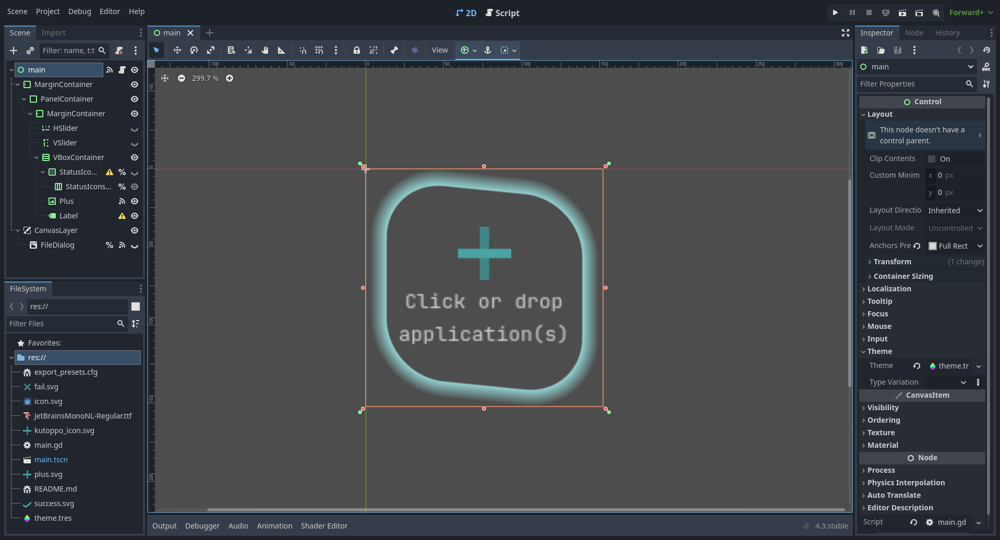

# kutoppo
Generate .desktop file by simply drag and drop applications



### Install
1. Download the binary from the release page ([direct download](#))
2. Make the binary executable
```sh
chmod +x kutoppo
```
### Usage
1. Drag and drop on the window or click to pick one or multiple applications 
2. Search the program in the Application launcher and start it

### Build
1. Clone the repo
```sh
git clone https://github.com/plucafs/kutoppo
```
2. Open Godot, click on the Import button and then select the `project.godot` file
3. Follow these steps:
	- Click on Project
	- Click on Export
	- Click on Add...
	- Select Linux
		- Install the templates (if it's your first export)
	- Click Export project...
	- Select the destination directory
### Assumptions
1. The .desktop file name is created based on the application file name
2. The .desktop file is placed inside `~/.local/share/applications`
3. The .desktop file icon name is the same as the application file name. Place the application icon, with the same name as the application file, in the folder `~/.local/share/pixmaps`
3. kutoppo doesn't check if the file dropped is an application or not


### Troubleshoot
1. The Application launcher doesn't find my applications

- Try updating the desktop database
```sh
sudo update-desktop-database
```

### Ideas
- Different modes
	- One for creating the .desktop file of the application, another for placing the application icon 

### Credits
- Made with [Godot](https://godotengine.org/) 4.3
- Font JetBrains Mono by [JetBrains](https://www.jetbrains.com/lp/mono/)
